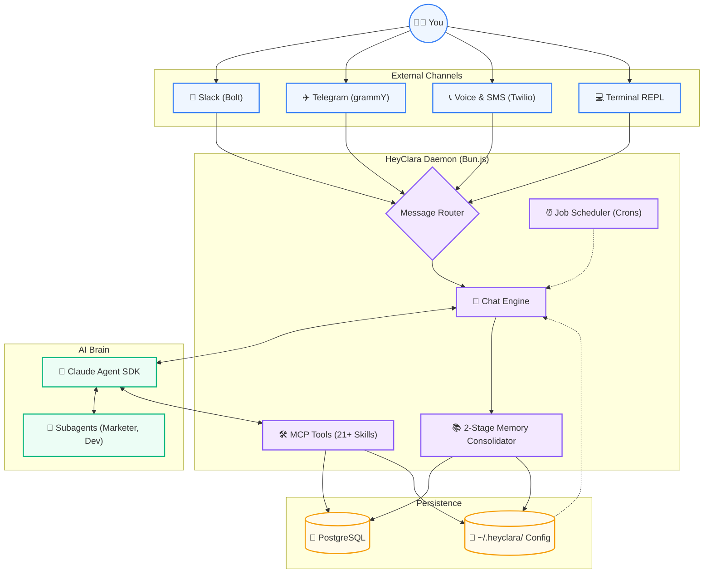
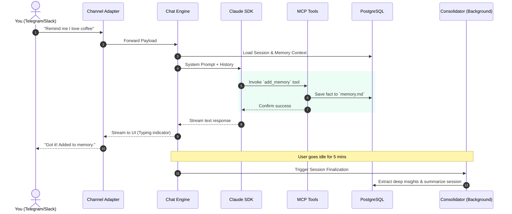

<div align="center">
  
  <h1>HeyClara 🧠</h1>
  <p><strong>A personal AI agent you fork, mold, and make your own.</strong></p>

  <p>
    <a href="https://www.npmjs.com/package/@devchiniwala/heyclara"></a>
    <a href="https://www.npmjs.com/package/@devchiniwala/heyclara"></a>
    <a href="https://bun.sh/"></a>
    <a href="https://github.com/DevChiniwala/HeyClara/blob/main/LICENSE"></a>
  </p>
</div>

---

**HeyClara** is a personal AI assistant daemon powered by the Claude Agent SDK. It runs scheduled jobs, chats with you across Telegram, Slack, Terminal, and Voice, and manages a deep persona system with on-demand memory consolidation.

Unlike bloated enterprise platforms, HeyClara is built for **one user**. It is small enough to understand, runs as a single background daemon, and acts as your personalized co-founder.

## 🌟 Philosophy

- **Small enough to understand:** One process, a few source files. No microservices, no message queues.
- **Customization = Code Changes:** Want different behavior? Modify the code. The codebase is deliberately tiny so it's safe to change.
- **AI-Native:** No complex dashboards. You configure and debug by talking to Clara.
- **Skills over features:** Instead of cramming the core codebase with features, you add lightweight Markdown `SKILL.md` folders (like `/add-discord`) that transform your fork.

---

## 🏗 System Architecture

The heart of HeyClara is a Bun.js daemon that connects an intelligent routing engine to your external channels (Slack, Telegram, Twilio Voice/SMS) while continuously persisting data to PostgreSQL. 



---

## ⚡ Data Flow: Message Lifecycle

How HeyClara processes an incoming message and remembers it forever.



---

## 🚀 Quick Start

Ensure you have [Bun](https://bun.sh) and PostgreSQL installed on your system.

```bash
# 1. Install globally
npm i -g @devchiniwala/heyclara

# 2. Interactive setup (wizard guides you through DB, API keys, and persona)
clara init

# 3. Start the background daemon!
clara start
```

---

## 🛠 Features Deep Dive

### 📡 Omni-Channel Presence
- **Slack (Socket Mode)**: Proactive thread awareness, thinking emojis, and file attachment handling.
- **Telegram (grammY)**: Instant DM access from your phone with live typing indicators.
- **Phone & Voice (Twilio + OpenAI Realtime)**: Clara can literally call you for a morning standup or evening retro.
- **Terminal Chat**: Rich REPL interface right in your CLI.

### 👥 The "Employee" System
Employees are persistent AI co-founders scoped to your projects. They aren't just prompts—they are fully operational entities with their own memory, goals, decisions, and org chart position. They transition between `onboarding`, `active`, and `paused` states.

### 🧠 Two-Stage Memory & Persona
Clara lives in `~/.heyclara/self/` with five core files: `identity.md`, `owner.md`, `soul.md`, `rules.md`, and `memory.md`. 
1. **Stage 1 (Consolidation)**: After a chat session goes idle, a background consolidator extracts facts and places them in a `staging.md` file.
2. **Stage 2 (Promotion)**: A nightly 3 AM cron job promotes reinforced candidates into permanent memory.

### ⏰ Stateful Jobs & Crons
Crons run 24/7. Jobs respect your defined "active hours". Every scheduled job gets its own sandboxed workspace and isolated working memory. Models can dynamically switch per-job to save API costs (e.g., using `haiku` for simple parsing and `sonnet` for heavy logic).

---

## 📂 Project Structure

```text
heyclara/
├── bin/
│   └── clara                 # CLI Entry executable
├── src/
│   ├── cli/                  # CLI command routing (job, agent, employee, self)
│   ├── core/                 # Daemon lifecycle, scheduler, memory consolidator
│   ├── chat/                 # Chat engine, identity injection, terminal REPL
│   ├── channels/             # Telegram, Slack, SMS, WhatsApp, and Voice implementations
│   ├── commands/             # Setup wizards, health checks, migrations
│   ├── db/                   # Lazy postgres connections, models (jobs, messages)
│   ├── mcp/                  # Tool definitions (21 tools: messaging, rules, agents)
│   └── prompts/              # System instruction assembly
├── defaults/                 # Default templates for identity, soul, and slack manifests
└── skills/                   # 40+ modular skills (e.g., programmatic-seo, pr-reviewer, docs)
```

---

## 💻 CLI Command Reference

HeyClara comes with a powerful CLI to manage the daemon, chat sessions, jobs, and config.

```bash
# Core
clara init                       # Interactive setup wizard
clara start / stop / restart     # Daemon lifecycle
clara status                     # Show daemon, jobs, channels, chat rooms
clara chat                       # Launch terminal REPL chat
clara run <prompt>               # One-shot execution

# Jobs
clara job list                   # List all background jobs
clara job add <name> <schedule> <prompt> # Add a new job
clara job remove <name>          # Delete a job
clara job run <name>             # Force trigger a job

# Employees & Persona
clara employee add               # Create a new AI co-founder
clara rules [show|reset]         # Manage behavioral instructions
clara memory [show|reset]        # Manage persistent context

# Config
clara config list                # View global config
clara config set <key> <value>   # Update config (e.g., channels.slack.enabled true)
```

---

## 🤝 Contributing

**Don't add features. Add skills.**

If you want to add Discord support, don't create a PR that bloats the core engine. Instead, contribute a skill folder (`skills/add-discord/SKILL.md`) that teaches Clara how to modify her own codebase to use Discord. You end up with a clean core engine that dynamically morphs to fit your needs.

## 📝 License

Released under the [MIT License](LICENSE). 
Created by Aman ([amankumar.ai](https://amankumar.ai)) • Maintained and Migrated by Dev Chiniwala.
