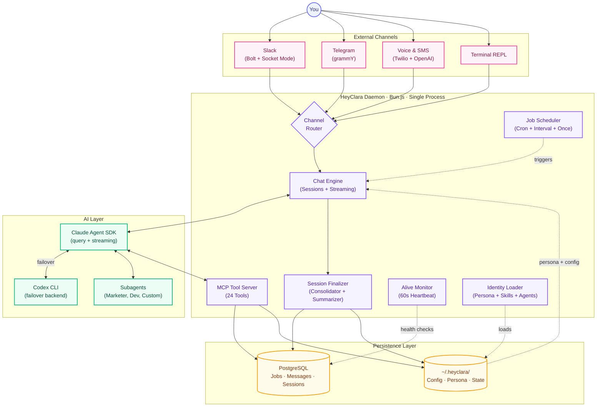
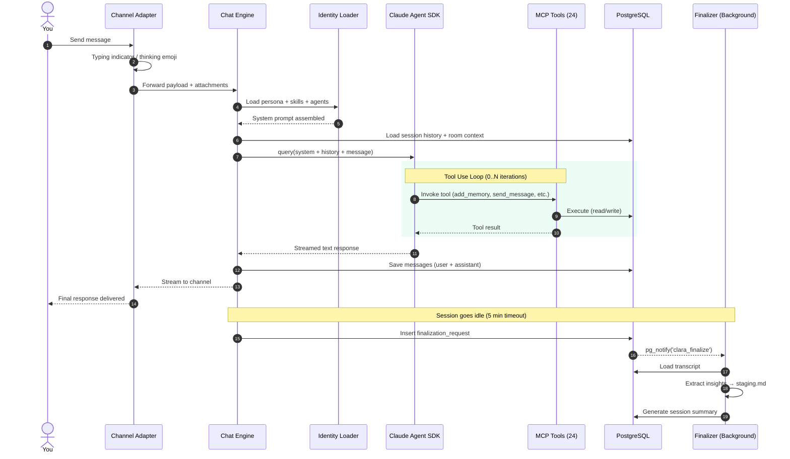
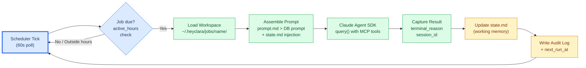
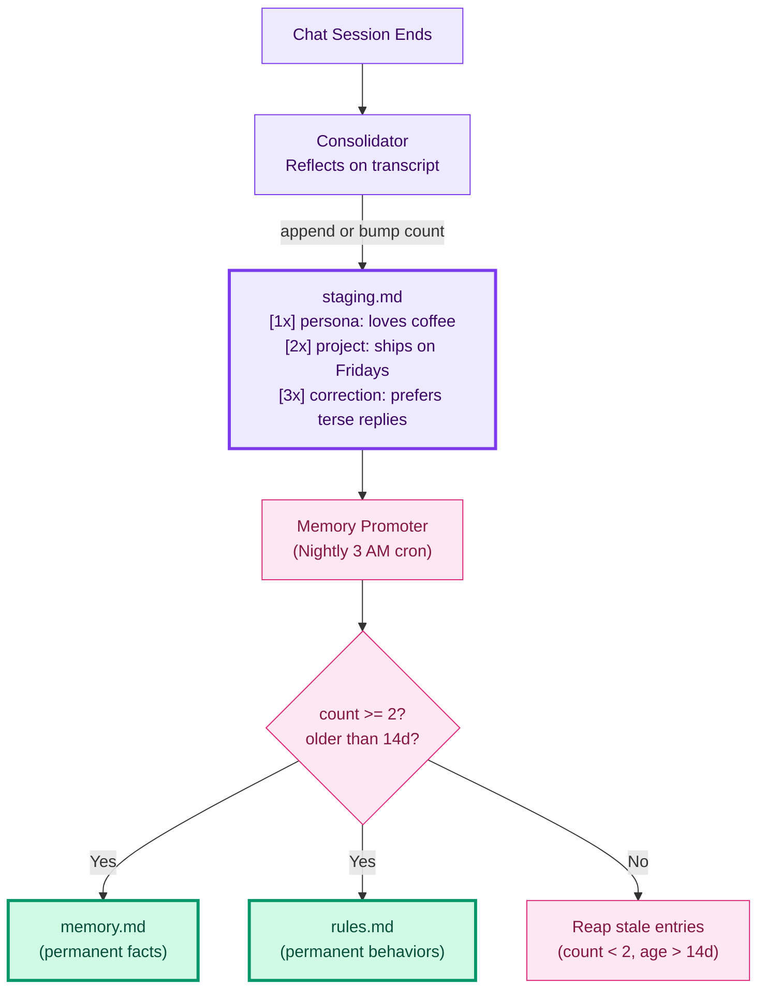
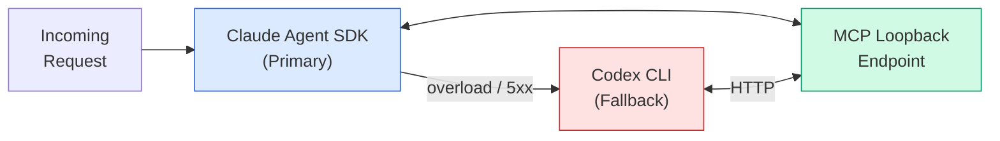
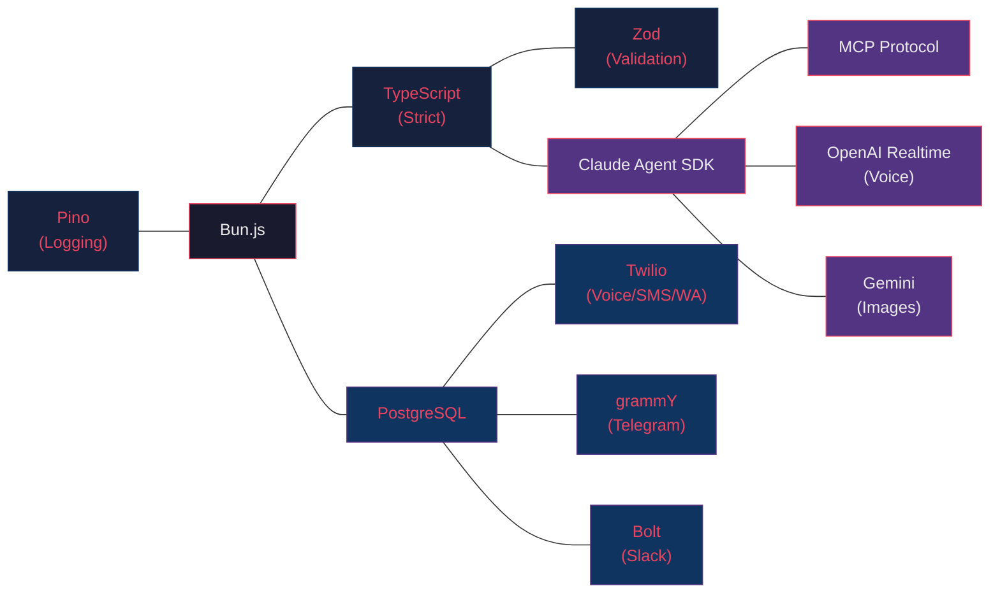
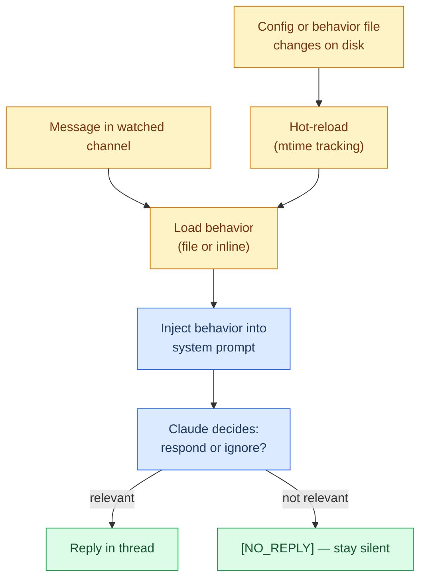

<div align="center">

  

  <h1>HeyClara</h1>
  <p><strong>Your personal AI daemon — fork it, mold it, make it yours.</strong></p>
  <p><em>A single-process AI assistant that runs scheduled jobs, chats across every channel, manages its own memory, and evolves with you.</em></p>

  <p>
    <a href="https://www.npmjs.com/package/@devchiniwala/heyclara"></a>
    <a href="https://www.npmjs.com/package/@devchiniwala/heyclara"></a>
    <a href="https://bun.sh/"></a>
    <a href="https://github.com/DevChiniwala/HeyClara/blob/main/LICENSE"></a>
    <a href="https://github.com/DevChiniwala/HeyClara"></a>
  </p>

  <br/>

  <picture>
    <source media="(prefers-color-scheme: dark)" srcset="https://raw.githubusercontent.com/DevChiniwala/HeyClara/main/docs/architecture-dark.svg">
    <source media="(prefers-color-scheme: light)" srcset="https://raw.githubusercontent.com/DevChiniwala/HeyClara/main/docs/architecture-light.svg">
    
  </picture>

</div>

---

## What is HeyClara?

HeyClara is a **personal AI assistant daemon** powered by the Claude Agent SDK. It runs as a single background process on your machine, connecting to Telegram, Slack, Voice/SMS (Twilio), and your terminal — while autonomously running scheduled jobs, consolidating memory, and managing a deep persona system.

Unlike enterprise AI platforms with microservices and message queues, HeyClara is built for **one user**. It's small enough to read in an afternoon, runs as a single daemon, and acts as your personalized AI co-founder.

<br/>

<div align="center">

```
  You talk to Clara.    Clara remembers.    Clara works while you sleep.
       |                      |                        |
   Telegram/Slack       2-stage memory          Scheduled jobs
   Voice/SMS/CLI        consolidation           with working state
```

</div>

---

## Philosophy

| Principle | What it means |
|-----------|---------------|
| **Small enough to understand** | One process, one daemon. No microservices, no queues, no Kubernetes. |
| **Customization = code changes** | Want different behavior? Modify the source. The codebase is deliberately tiny. |
| **AI-Native** | No dashboards. You configure and debug by *talking* to Clara. |
| **Skills over features** | Instead of bloating core, you add `SKILL.md` folders that teach Clara new capabilities. |
| **Single-agent architecture** | One capable agent with tools beats multi-agent orchestration. [Research-backed.](MULTI_AGENT_PHILOSOPHY.md) |

---

## System Architecture

<div align="center">



</div>

---

## Data Flow: Message Lifecycle

<div align="center">



</div>

---

## Job Execution Flow

<div align="center">



</div>

---

## Two-Stage Memory System

<div align="center">



</div>

---

## Quick Start

```bash
# Install globally (requires Bun and PostgreSQL)
npm i -g @devchiniwala/heyclara

# Interactive setup — walks you through DB, API keys, channels, persona
clara init

# Start the background daemon
clara start

# Chat in your terminal
clara chat

# Check everything is healthy
clara health
```

<details>
<summary><strong>Manual Setup (without wizard)</strong></summary>

```bash
# 1. Clone and install
git clone https://github.com/DevChiniwala/HeyClara.git
cd HeyClara && bun install

# 2. Create the database
createdb heyclara

# 3. Create config at ~/.heyclara/config.yaml
cat > ~/.heyclara/config.yaml << 'EOF'
database_url: postgres://localhost:5432/heyclara
model: default
timezone: America/New_York
channels:
  enabled: true
  default: telegram
  telegram:
    enabled: true
    bot_token: YOUR_BOT_TOKEN
    chat_id: YOUR_CHAT_ID
EOF

# 4. Run in foreground (dev mode)
bun run dev
```

</details>

---

## Features

### Omni-Channel Presence

| Channel | Transport | Features |
|---------|-----------|----------|
| **Slack** | Bolt (Socket Mode) | Thread awareness, thinking emoji, file attachments (any MIME, up to 50MB), watch channels with hot-reload behaviors, `[NO_REPLY]` silent judgment |
| **Telegram** | grammY | Typing indicators, DM access from phone, open/closed mode |
| **Voice** | Twilio + OpenAI Realtime | Inbound/outbound calls, live audio bridge, tool use mid-call (consult Claude, send Telegram, save memory, end call) |
| **SMS** | Twilio | Inbound webhooks, `/reset` support, session rotation |
| **WhatsApp** | Twilio Sandbox | 24h customer-service window enforcement |
| **Terminal** | Built-in REPL | Rich CLI chat with streaming |

### Scheduled Jobs & Crons

- **Three schedule types:** cron expressions (`0 9 * * *`), intervals (`5m`, `2h`, `1d`), one-shot ISO timestamps
- **Active hours:** Jobs respect your defined hours; crons (`always: true`) run 24/7
- **Stateful workspaces:** Each job gets `~/.heyclara/jobs/<name>/` with `prompt.md` and `state.md`
- **Model routing:** Per-job model override (`haiku` for cheap parsing, `sonnet` for heavy logic)
- **Agent assignment:** Jobs can run under a specific agent's persona
- **Audit logging:** Every run captures `terminal_reason`, session ID, timing

### Employee System

Employees are persistent AI co-founders scoped to projects — not just role prompts, but full identities with their own memory, goals, decisions, and org chart position.

```
clara employee add          # Create new employee
clara employee list         # List all with status
clara employee pause <name> # Temporarily deactivate
clara employee <name>       # Chat as that employee
```

Lifecycle: `onboarding` → `active` → `paused`

### Two-Stage Memory & Persona

Clara lives in `~/.heyclara/self/` with five core files:

| File | Purpose |
|------|---------|
| `identity.md` | Who Clara is — name, personality, voice |
| `owner.md` | Who you are — context about the user |
| `soul.md` | Deep behavioral guidelines |
| `rules.md` | Live behavioral instructions (verbs) — hot-loaded every session |
| `memory.md` | Permanent facts (nouns) — hot-loaded every session |

**Stage 1 — Consolidation:** After a chat session goes idle, a background consolidator reflects on the transcript and appends candidate entries to `staging.md` with reinforcement counting (`[1x]`, `[2x]`, `[3x]`).

**Stage 2 — Promotion:** A nightly cron (3 AM) reaps entries older than 14 days with count < 2, and promotes qualifying candidates (count >= 2 + durability review) to permanent `memory.md` or `rules.md`.

### MCP Tool Server (24 Tools)

Clara exposes tools to the AI via the Model Context Protocol:

| Category | Tools |
|----------|-------|
| **Jobs** | `list_jobs`, `add_job`, `update_job`, `remove_job`, `enable_job`, `disable_job`, `archive_job`, `unarchive_job`, `run_job` |
| **Messaging** | `send_message` (with media, target routing), `list_messages`, `search_messages` |
| **Sessions** | `list_sessions`, `read_session` |
| **Memory** | `add_memory`, `read_memory`, `add_rule` |
| **Agents** | `list_agents`, `list_employees` |
| **Watch** | `add_watch_channel`, `remove_watch_channel`, `enable_watch_channel`, `disable_watch_channel` |
| **Voice** | `place_call` (outbound with goal, context, duration cap) |

### Harness-Agnostic Backends & Failover



- **Primary:** Claude Agent SDK (`query()` with streaming)
- **Fallback:** Codex CLI (auto-failover on persistent overload/5xx)
- **Shared tools:** Both backends connect to the same MCP tool server — no drift

### Alive Monitor & Self-Recovery

The daemon runs a 60-second heartbeat that checks health (version, daemon, config, DB, channels, API keys, persona, logs). On database failure:

1. Attempts reconnection
2. Deterministic Postgres recovery (stale PID removal + service restart)
3. LLM recovery agent as fallback for non-trivial issues
4. Notifies user with postmortem via Telegram/Slack

### 40+ Skills

Skills are modular `SKILL.md` folders that teach Clara new capabilities without touching core:

<details>
<summary><strong>View all skills</strong></summary>

| Skill | Description |
|-------|-------------|
| `agent-skill-creator` | Create new agent/skill definitions |
| `aws-cli` | AWS CLI operations |
| `clara-image` | Visual identity generation (Gemini) |
| `clara-phone` | Voice call management |
| `code-review` | Language-aware PR review |
| `codex` | Codex CLI integration |
| `content-strategy` | Content planning |
| `copywriting` | Professional copy |
| `cro` | Conversion rate optimization |
| `customer-research` | User research frameworks |
| `documents` | Document generation |
| `email` | Email composition |
| `frontend-design` | UI/UX patterns |
| `gh-stamp` | GitHub PR approval workflow |
| `github-link-repo-explorer` | Repository analysis |
| `google-workspace-cli` | Google Workspace operations |
| `image-generation` | General-purpose images (OpenAI + Gemini) |
| `marketing` | Marketing strategy |
| `modal-cli` | Modal deployment |
| `optimization-loop` | Iterative optimization |
| `optimize` | Performance optimization workspaces |
| `plan-review` | Plan critique |
| `product-marketing-context` | PMM frameworks |
| `programmatic-seo` | Scalable PSEO systems |
| `qa` | Quality assurance |
| `remotion` | Video generation |
| `render-cli` | Render.com deployment |
| `retro` | Sprint retrospectives |
| `seo` | Search optimization |
| `shopify` | E-commerce operations |
| `slack` | Slack messaging primitives |
| `svg-animations` | Animated SVGs |
| `taskmaster` | Task management |
| `userinterface-wiki` | UI documentation |
| `whisper-cpp-transcribe` | Audio transcription |
| `wrangler` | Cloudflare Workers |
| `yc-office-hours` | YC-style feedback |

</details>

---

## Tech Stack

<div align="center">



</div>

| Layer | Technology |
|-------|-----------|
| **Runtime** | [Bun](https://bun.sh) >= 1.0 |
| **Language** | TypeScript (strict, ESNext) |
| **AI** | Claude Agent SDK, OpenAI Realtime, Gemini |
| **Protocol** | Model Context Protocol (MCP) |
| **Database** | PostgreSQL (via `postgres` driver) |
| **Channels** | grammY (Telegram), Bolt (Slack), Twilio (Voice/SMS/WhatsApp) |
| **Validation** | Zod v4 |
| **Logging** | Pino |
| **Images** | Sharp (processing), Gemini/OpenAI (generation) |

---

## Project Structure

```
heyclara/
├── bin/
│   └── clara                        # Shell wrapper (checks Bun, resolves paths)
├── src/
│   ├── cli/                         # Command routing
│   │   ├── index.ts                 # Entry point, subcommand dispatch
│   │   ├── job.ts                   # Job management (list, add, run, log)
│   │   ├── agent.ts                 # Agent inspection
│   │   ├── employee.ts              # Employee lifecycle
│   │   ├── channels.ts              # Channel control (send, off, on)
│   │   ├── phone.ts                 # Voice smoke-test
│   │   ├── self.ts                  # Persona commands (rules, memory)
│   │   ├── watch.ts                 # Slack watch management
│   │   ├── status.ts                # Status output
│   │   ├── active.ts                # Active engine detail
│   │   └── model.ts                 # Global model show/set
│   ├── core/                        # Daemon internals
│   │   ├── daemon.ts                # Lifecycle, startup guard, service-aware restart
│   │   ├── runner.ts                # Job execution (Claude SDK + Codex failover)
│   │   ├── agents.ts                # Agent scanner (project + user + shared dirs)
│   │   ├── scheduler.ts             # Due-time queries, cron/interval/once
│   │   ├── consolidator.ts          # Background memory extraction
│   │   ├── summarizer.ts            # Session summary generation
│   │   ├── finalizer.ts             # Unified post-session pipeline
│   │   └── alive.ts                 # Health heartbeat + self-recovery
│   ├── chat/                        # Conversation engine
│   │   ├── engine.ts                # Claude SDK query(), sessions, streaming
│   │   ├── identity.ts              # Persona + skill + agent prompt assembly
│   │   └── repl.ts                  # Terminal REPL interface
│   ├── channels/                    # Channel implementations
│   │   ├── telegram.ts              # Telegram (typing indicators, DM)
│   │   ├── slack.ts                 # Slack (threads, emoji, attachments)
│   │   ├── slack/                   # Slack submodules
│   │   │   ├── attachments.ts       # File handling (any MIME, 50MB)
│   │   │   └── watch.ts            # Proactive channel monitoring
│   │   ├── sms.ts                   # SMS (Twilio webhooks)
│   │   ├── whatsapp.ts             # WhatsApp (24h window)
│   │   ├── phone/                   # Voice channel
│   │   │   ├── index.ts            # Route registration
│   │   │   ├── twiml.ts            # TwiML XML builders
│   │   │   ├── relay.ts            # Twilio ↔ OpenAI Realtime bridge
│   │   │   ├── instructions.ts     # Voice system prompts
│   │   │   ├── tools.ts            # Mid-call tools (consult, send, save)
│   │   │   └── consult.ts          # Claude escape hatch for reasoning
│   │   ├── twilio/                  # Shared Twilio infrastructure
│   │   │   ├── server.ts           # Bun HTTP+WS + middleware
│   │   │   ├── signature.ts        # HMAC-SHA1 validation
│   │   │   ├── rest.ts             # placeCall, sendMessage, hangupCall
│   │   │   ├── dedup.ts            # TTL MessageSid/CallSid dedup
│   │   │   └── rate-limit.ts       # Sliding-window limiter (30/min)
│   │   └── common/
│   │       └── chat-session.ts      # Shared engine creation + room rotation
│   ├── commands/                    # CLI commands (non-daemon)
│   │   ├── init.ts                  # Interactive setup wizard
│   │   ├── service.ts              # OS service registration
│   │   ├── db.ts                   # Database setup
│   │   ├── backup.ts              # Config + DB backup with auto-prune
│   │   ├── validate.ts            # Config validation
│   │   ├── health.ts              # Health checks
│   │   └── health-db.ts           # DB-specific health check
│   ├── db/                          # Database layer
│   │   ├── connection.ts           # Lazy postgres, withDb() helper
│   │   ├── migrate.ts             # SQL migration runner
│   │   ├── migrations/            # Numbered .ts migration files
│   │   └── models/
│   │       ├── job.ts             # Job CRUD + pg_notify
│   │       ├── message.ts         # Chat message storage + room stats
│   │       ├── session.ts         # Session tracking
│   │       └── active_engine.ts   # Active engine registry
│   ├── mcp/                        # Tool server
│   │   ├── index.ts               # MCP factory (per-query instances)
│   │   ├── server.ts             # SDK MCP server creation
│   │   └── tools/
│   │       ├── table.ts           # Single declarative tool table
│   │       ├── jobs.ts            # Job management handlers
│   │       ├── send.ts            # Messaging handlers
│   │       ├── messages.ts        # History/search handlers
│   │       ├── watch.ts           # Watch channel handlers
│   │       └── misc.ts            # Memory, rules, agents, calls
│   ├── prompts/                    # System prompt templates
│   │   ├── index.ts              # Loader + interpolation
│   │   ├── environment.md        # Environment/config/memory template
│   │   ├── mode-chat.md          # Chat mode instructions
│   │   ├── mode-job.md           # Job mode instructions
│   │   ├── channel-slack.md      # Slack-specific rules
│   │   └── channel-telegram.md   # Telegram-specific rules
│   ├── types/                     # All type definitions
│   │   ├── index.ts              # Barrel export
│   │   ├── enums.ts             # JobStatus, ScheduleType, Mode, etc.
│   │   ├── config.ts            # Config interfaces
│   │   ├── job.ts               # JobInput, JobResult
│   │   ├── engine.ts            # ChatEngine, EngineOptions
│   │   └── channel.ts           # Channel, ChannelFactory
│   ├── constants/                 # Constant values
│   │   ├── index.ts             # DEFAULT_DATABASE_URL
│   │   └── attachment.ts        # Size limits, MIME types
│   └── utils/                    # Shared utilities
│       ├── config.ts            # Config loading, readRawConfig()
│       ├── paths.ts             # Path resolution from CLARA_HOME
│       ├── cli.ts               # CLI helpers, TTY colors
│       ├── errors.ts            # errMsg() helper
│       ├── log.ts               # Pino logger
│       ├── logger.ts            # JSONL audit + cron state
│       ├── time.ts              # Local timezone formatting
│       ├── duration.ts          # Duration string parsing
│       ├── pid.ts               # PID file management
│       ├── retry.ts             # withRetry() helper
│       └── attachment.ts        # MIME classification, image prep
├── agents/                       # Agent definitions
│   ├── marketer/AGENT.md        # Marketing specialist
│   └── senior-dev/AGENT.md     # Senior developer
├── skills/                      # 40+ modular skills
├── defaults/                    # Template files for clara init
│   ├── self/                   # identity, soul, owner, memory templates
│   └── channels/
│       └── slack-manifest.json # Slack app manifest with all scopes
├── tests/                       # Test suite (mirrors src/ structure)
├── docs/                        # Architecture diagrams
├── package.json
├── tsconfig.json
└── bun.lock
```

---

## CLI Reference

### Core Commands

```bash
clara init                          # Interactive setup wizard
clara start                         # Start background daemon (OS service)
clara stop                          # Stop daemon (waits for active engines)
clara restart                       # Service-aware restart
clara status                        # Daemon, jobs, channels, chat rooms
clara health                        # Full health check (DB, channels, API keys)
clara chat                          # Terminal REPL chat
clara chat --agent <name>           # Chat with specific agent persona
clara chat --employee <name>        # Chat as employee
clara run <prompt>                  # One-shot execution
clara update                        # Update to latest + restart daemon
```

### Job Management

```bash
clara job list                      # List all jobs with status and next run
clara job show <name>               # Job details + recent audit log
clara job add <name> <schedule> <prompt>  # Create a job
clara job update <name> [--schedule] [--prompt] [--model]
clara job run <name>                # Force trigger immediately
clara job log <name>                # View execution history
clara job archive <name>            # Hide from list, stop running
clara job unarchive <name>          # Restore to disabled state
```

### Employee Management

```bash
clara employee add                  # Create new AI co-founder
clara employee list                 # List all with role, project, status
clara employee show <name>          # Full details + memory
clara employee pause <name>         # Temporarily deactivate
clara employee resume <name>        # Reactivate
clara employee remove <name>        # Delete permanently
clara employee approvals            # Manage pending approvals
clara employee <name>               # Chat as employee (shorthand)
```

### Configuration

```bash
clara config list                   # View all config
clara config get <key>              # Get value (dot notation: channels.default)
clara config set <key> <value>      # Set value
clara model                         # Show current model
clara model <name>                  # Set global model (haiku, sonnet, opus)
clara channels off                  # Disable all channels (dev mode)
clara channels off telegram         # Disable one channel
clara channels on telegram          # Re-enable
```

### Persona

```bash
clara rules                         # Show current rules
clara rules reset                   # Reset to defaults
clara memory                        # Show permanent memory
clara memory reset                  # Clear all memory
```

---

## Configuration

All config lives in `~/.heyclara/config.yaml`:

```yaml
database_url: postgres://localhost:5432/heyclara
model: default                    # default | haiku | sonnet | opus
timezone: America/New_York
log_level: info
active_hours:
  start: "09:00"
  end: "23:00"
session_finalization:
  enabled: true
  memory_consolidation: true
  summaries: true
runner: claude                     # claude | codex
fallback:
  - codex                         # auto-failover on provider outage
channels:
  enabled: true
  default: telegram
  telegram:
    enabled: true
    bot_token: ...
    chat_id: ...
    open: false                   # true = anyone can chat
  slack:
    enabled: true
    bot_token: xoxb-...
    app_token: xapp-...
    dm_user_id: U06PBA2P680
    watch:                        # proactive channel monitoring
      "C123#general": {}
      "C456#alerts":
        behavior: security-watch
  twilio:
    sid: ...
    secret: ...
    auth_token: ...
  phone:
    enabled: true
    from_number: +1...
    port: 8080
    voice: alloy
    allowlist: ["+1..."]
  sms:
    enabled: true
    from_number: +1...
  whatsapp:
    enabled: true
    from_number: +1...
gemini_api_key: ...
openai_api_key: ...
```

Environment variables override config: `DATABASE_URL`, `TELEGRAM_BOT_TOKEN`, `SLACK_BOT_TOKEN`, `SLACK_APP_TOKEN`, `GEMINI_API_KEY`, `OPENAI_API_KEY`, `TWILIO_SID`, `TWILIO_AUTH_TOKEN`, `PHONE_FROM_NUMBER`, `PUBLIC_BASE_URL`, and more.

---

## How Watch Channels Work

Watch channels let Clara proactively monitor Slack channels — receiving ALL messages (not just @mentions) and deciding autonomously whether to respond.



Each watch lives in `~/.heyclara/watches/<name>/behavior.md`. Behaviors hot-reload without daemon restart.

---

## Development

```bash
# Install dependencies
bun install

# Run in foreground (dev mode)
bun run dev

# Type check
npm run typecheck

# Run full test suite (typecheck + cycle check + tests)
npm run test

# Run tests only
npm run test:bun

# Check for circular imports
npm run check:cycles
```

### Test Isolation

Tests set `CLARA_HOME` to a temp directory and call `resetConfig()` in cleanup. DB tests use a shared setup that auto-creates a `heyclara_test` database.

---

## Deployment

```bash
# Install as OS service (launchd on macOS, systemd on Linux)
clara start

# The daemon auto-registers itself. To manually manage:
clara stop --force              # Skip engine wait, force shutdown
clara restart --wait 5          # Wait up to 5 min for engines to clear
```

### Backup & Restore

```bash
clara backup                    # Creates timestamped backup (config + persona + pg_dump)
                                # Auto-prunes old backups
```

---

## Security

- **Twilio signature validation** — HMAC-SHA1 on every webhook
- **Rate limiting** — Sliding-window per-key (30 req/min default)
- **Message dedup** — TTL-based MessageSid/CallSid dedup (handles Twilio retries)
- **Credential isolation** — Sensitive env vars filtered before passing to Codex subprocess
- **Closed mode** — Telegram `open: false` restricts to configured `chat_id` only
- **Slack owner verification** — Messages prefixed with `[user:ID]` for reliable auth
- **Phone allowlist** — Only configured numbers can trigger inbound calls

---

## Contributing

**Don't add features. Add skills.**

Want Discord support? Don't create a PR that bloats the core. Instead, contribute a skill folder (`skills/add-discord/SKILL.md`) that teaches Clara how to add Discord herself. The core stays clean; capabilities grow organically.

```bash
# Create a new skill
mkdir skills/my-skill
cat > skills/my-skill/SKILL.md << 'EOF'
# My Skill

Description of what this skill does and when to use it.

## Steps
1. ...
2. ...
EOF
```

---

## Roadmap

- [x] Claude Agent SDK integration
- [x] Multi-channel (Telegram, Slack, Voice, SMS, WhatsApp)
- [x] Two-stage memory consolidation
- [x] Stateful job workspaces
- [x] Employee system (persistent AI co-founders)
- [x] Harness-agnostic backends (Claude + Codex failover)
- [x] Self-recovery (alive monitor + LLM agent)
- [x] 40+ skills
- [ ] Discord channel
- [ ] Web UI dashboard
- [ ] Mobile app (React Native)
- [ ] Multi-user mode

---

## License

Released under the [MIT License](LICENSE).

Created by [Dev Chiniwala](https://devchiniwala.com).

---

<div align="center">
  <br/>
  <p><strong>Clara is small by design. Fork it. Mold it. Make it yours.</strong></p>
  <br/>
  <a href="https://github.com/DevChiniwala/HeyClara">
    
  </a>
  <a href="https://www.npmjs.com/package/@devchiniwala/heyclara">
    
  </a>
</div>
